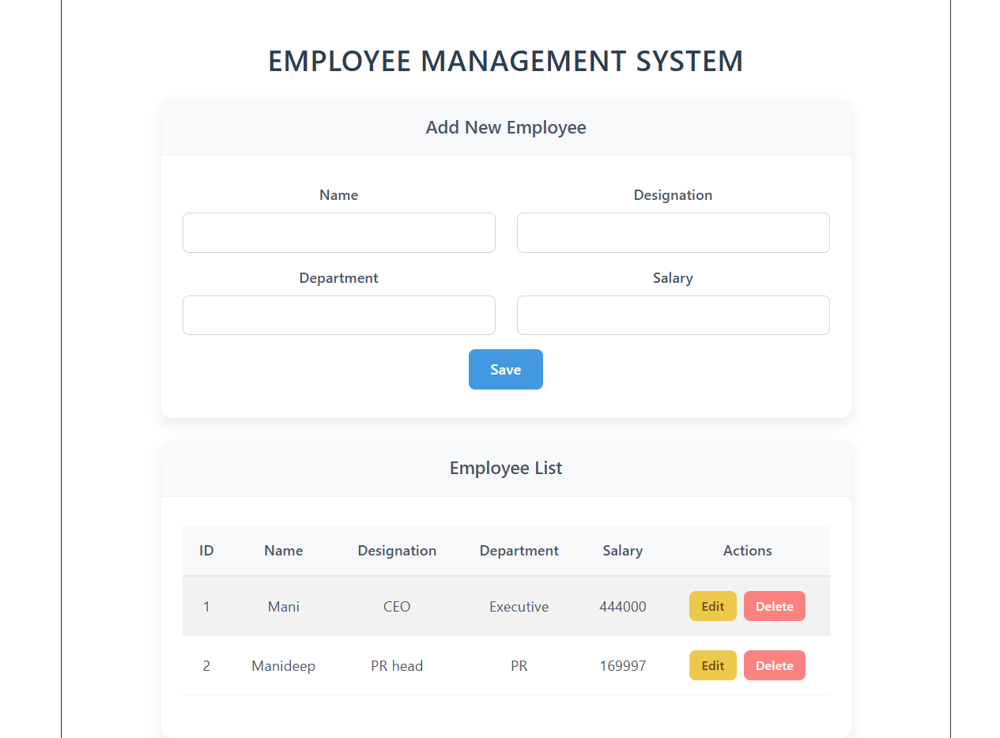
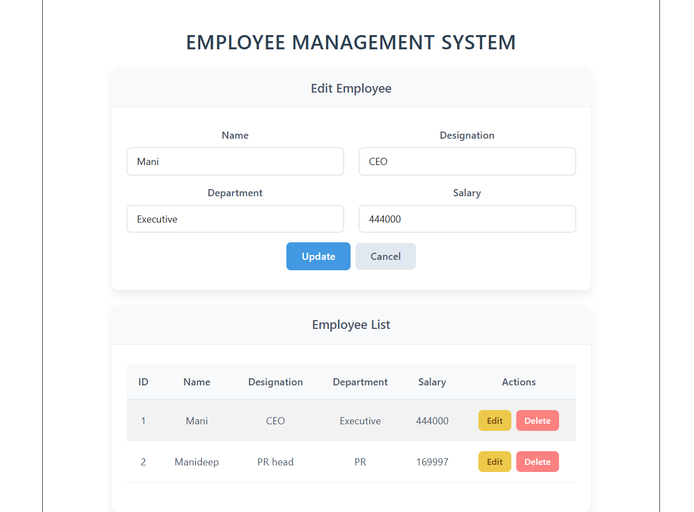

# Employee Management System

A modern Employee Management System built with Vue 3, Vite, and Bootstrap. This project interacts with a mock API frontend to add, edit, delete, and list employees.

## Features

- View all employees in a clean table format
- Add new employees
- Edit existing employee details
- Delete employees
- Modern, responsive UI with custom CSS and system fonts

## Screenshots

**Employee List View:**


**Add/Edit Employee:**


## Project Setup

1. Install dependencies:

```bash
npm install
```

2. Compile and Hot-Reload for Development:

```bash
npm run dev
```

3. Build for Production:

```bash
npm run build
```
